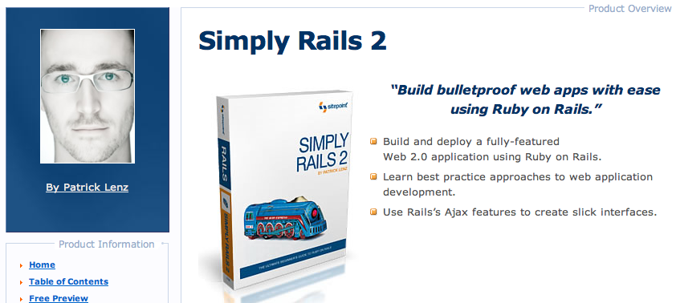
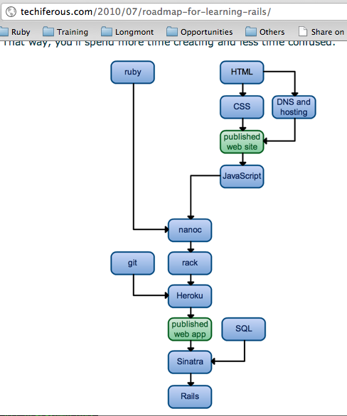
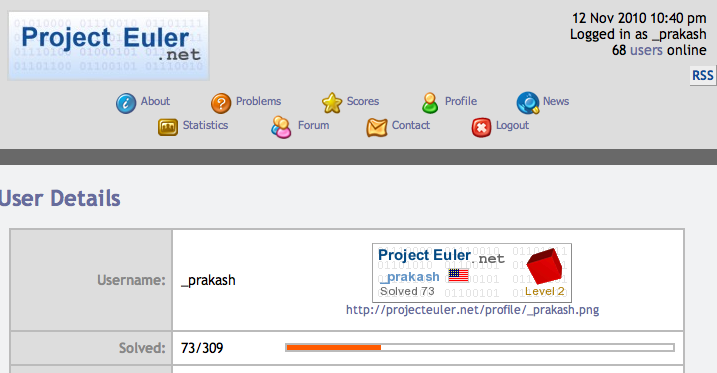
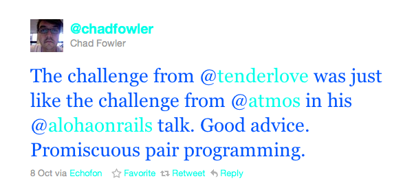
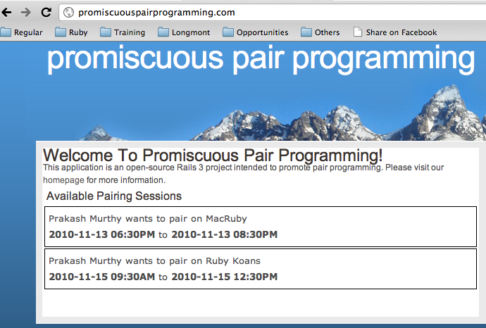

!SLIDE 
# Adventures of a Ruby Nuby #

!SLIDE bullets incremental
# Who Am I #

* Prakash Murthy ( @_prakash ) - Ruby Nuby
* Learning Ruby & Rails since Early June (Only 5 months into all this, Yo)
* Worked in NY as a Systems Analyst for 10 years - and avoided coding at all costs 
* Little bit of programming experience - in Visual C++, Java & Shell Scripts

!SLIDE bullets incremental 
# The beginning #
* Decided to move to Boulder, CO
* Started with the purchase of Simply Rails 2 book **on June 10!!**

!SLIDE bullets incremental 
# How has been the ride so far? #

* Very enjoyable 
* "Ruby treats you like a grown-up programmer." - Matz (via @ngauthier)

!SLIDE bullets incremental 
# Roadblocks #

* Also OVERWHELMING!!
* Too much choice & variety in recommendations for 
* "What to learn?", 
* "What resources to use for learning - books, screen-casts, blogs, etc."

* Do the "Deer caught in headlights" thing. 

!SLIDE bullets incremental 

* CHOICE IS GOOD!

!SLIDE bullets incremental 
# Forging ahead #

* Learning just Rails is NOT possible
* A very relevant post by Wyatt Greene ( @_techiferous ) : Roadmap for learning Rails

!SLIDE  
# Roadmap for learning Rails #

!SLIDE bullets
# Learning Ruby #

* Among the many books recommended for beginners, the one I found very useful was:
* "Learn to Program" - by Chris Pine
* Now reading up Rails Tutorials by Michael Hartl

!SLIDE
# Writing code. Lots of it. #

* Project Euler 

!SLIDE 
# Promiscuous Pair Programming - the inspiration#

!SLIDE 
# Promiscuous Pair Programming - the site#
https://github.com/prakashmurthy/promiscuous_pair_programming

!SLIDE bullets incremental
# My 3 requests to this community #
* MENTOR
* MENTOR
* MENTOR